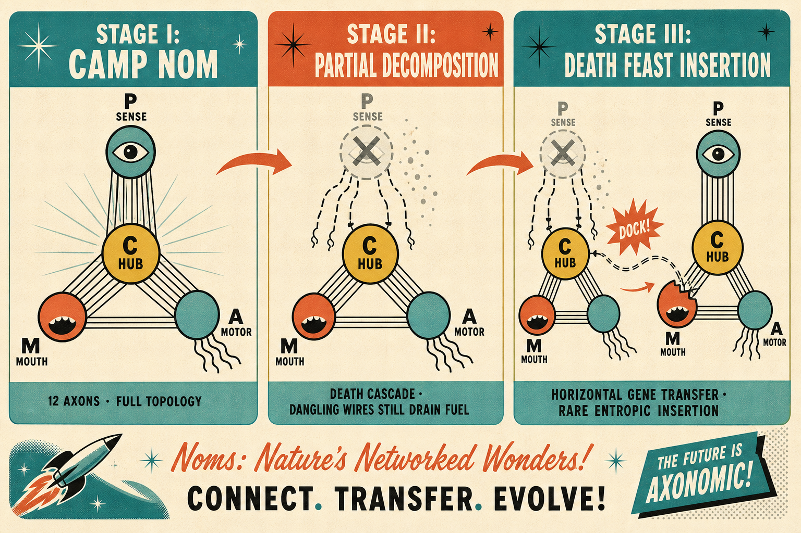

# Evo-Lab

A **virtual evolutionary laboratory** in a procedural **3D tidal world**. Watch **Noms** — the things that **nom** — swim, starve, die, and begin to **exchange wiring** in an early-Earth-style shallow sea.

Public **work-in-progress**: experimental, fun to run, behaviour and APIs will change. See [docs/MARKETING-COMMS.md](docs/MARKETING-COMMS.md) for visual language and [docs/HGT-INSERTION.md](docs/HGT-INSERTION.md) for the latest evolution mechanics.



## What are Noms?

**Noms** is the umbrella name for wet-layer life that exists mainly to **nom**:

| Kind | What it is |
|------|------------|
| **Organisms** | Structured life — **CAMP** chain (Perceptor, Mouth, Computer, Actuator), Y-star skeleton, 12 neural axons |
| **Energon** | Byte-string food — sunfall rain, cloaca trails, corpse fragments |

**Energon** is the technical food substrate; **Nom** is the friendly collective.

## Current snapshot (Phase 2.x)

- Procedural heightmap terrain with **global tides**, hydrology, and water-column bands (dry → open deep)
- **CAMP Nom** — P scans, M feeds (with postingestive diet / gag reflex), C hub digests & dispatches, A propels; universal **0–7 confidence** bytes on neural axons
- **Horizontal gene transfer (R0)** — death leaves **partial topology** (dangling axons); rare **uncapped-end INSERTION** when another Nom brushes the open stub at a corpse (**death feast**)
- **Axon transit basal** — idle/dangling wires still drain fuel from survivors
- Interactive **SDL + OpenGL** viewer (default ~60 CAMP Noms on wet terrain)
- **Catch2** unit tests (153+) including statistical **death feast** dock calibration
- Headless smoke test

**Not yet:** parthenogenesis / vertical reproduction, Grover birth floor, geography curriculum, full genotype string evolution.

## Design documentation

| Doc | Contents |
|-----|----------|
| [docs/DESIGN-NOTES.md](docs/DESIGN-NOTES.md) | Architecture, metabolism, trust/chaos |
| [docs/HGT-INSERTION.md](docs/HGT-INSERTION.md) | HGT + INSERTION spec (R0) |
| [docs/EVOLUTION.md](docs/EVOLUTION.md) | Rollout plan, literature, parthenogenesis economics |
| [docs/PARTHENOGENESIS.md](docs/PARTHENOGENESIS.md) | R1 asexual reproduction — two-layer entropy, energon ledger |
| [docs/MARKETING-COMMS.md](docs/MARKETING-COMMS.md) | Public visual language & tone |
| [docs/KINEMATICS.md](docs/KINEMATICS.md) | Skeleton FK / bundle gaps |

## Requirements

### Play a release build (itch.io download)

- **Windows 10/11 (64-bit)** — current public builds are Windows `.exe` only
- **GPU with OpenGL 3.3+** and up-to-date graphics drivers
- **No compiler or CMake required** — extract the zip and run; you do **not** need to build from source unless you want to develop or run tests

### Build from source (developers)

- **CMake** 3.20+
- **C++20** compiler
- Windows build tested with **MinGW** (WinLibs LLVM)

## Play (itch.io / release zip)

**You do not need to build the project to play.** The itch download should be a **zip folder**, not a lone `evo-lab.exe`.

### 1. Extract the whole zip

Unzip into a normal folder (e.g. `C:\Games\evo-lab\`). Do **not** copy only `evo-lab.exe` to the Desktop — the game looks for data files **next to the executable**.

### 2. Folder layout (must look like this)

```text
evo-lab/
  evo-lab.exe
  assets/
    fonts/
      LexendDeca-Regular.ttf
  resources/
    sprites/
      mouth_sprites.json
      mouth_sprites.png
      perceptor_sprites.json
      perceptor_sprites.png
      actuator_sprites.json
      actuator_sprites.png
```

If `assets/` or `resources/` is missing, the sim may still open but the HUD font and neuron sprites will not load correctly. Re-download the **full** zip from itch, or build locally (below) — CMake copies these files beside the exe automatically.

### 3. Run

**Double-click** `evo-lab.exe`, or from PowerShell in that folder:

```powershell
cd path\to\evo-lab
.\evo-lab.exe
```

Optional flags:

```powershell
.\evo-lab.exe --seed 42 --resolution 128 --nom-count 60
.\evo-lab.exe --help
```

**Controls:** drag = orbit · scroll = zoom · **Space** = pause · **R** = regenerate world · **Esc** = quit

Hover a Nom for the live inspector (P/M/C/A stores, axon signals, focus).

### Troubleshooting (Windows)

| Symptom | What to try |
|---------|-------------|
| Nothing happens / window flashes | Run from PowerShell in the `evo-lab` folder and read stderr. Check OpenGL 3.3+ drivers. |
| Windows SmartScreen blocks the exe | **More info → Run anyway** (unsigned indie build). |
| No HUD text / plain circles instead of sprites | Exe was moved without `assets/` and `resources/` — use the full zip layout above. |
| Black screen after load | Update GPU drivers; check `startup.trace` in the same folder as the exe for the last startup step. |

Headless smoke (no window):

```powershell
.\evo-lab.exe --headless --frames 120 --seed 42 --exit
```

## Build from source

For contributors, testers, or if the itch zip is incomplete.

```powershell
git clone <repo-url> evo-lab
cd evo-lab
cmake -B build -G "MinGW Makefiles" -DCMAKE_BUILD_TYPE=Release
cmake --build build --target evo-lab evo-lab-tests
ctest --test-dir build --output-on-failure
```

Run the built game (assets are copied next to the exe by CMake):

```powershell
.\build\src\evo-lab.exe
# optional: --seed 42 --resolution 128 --archetype nom --nom-count 60
```

**Archetypes:** `nom` (default CAMP), `stem`, `actuator`

**Packaging for itch:** zip everything under `build\src\` (exe + `assets\` + `resources\`), not the exe alone.

## Tests

Requires a local build (`evo-lab-tests` target):

```powershell
.\build\tests\evo-lab-tests.exe "[hgt]"
.\build\tests\evo-lab-tests.exe "[death_feast]"   # rub-until-fire INSERTION calibration
.\build\tests\evo-lab-tests.exe "[nom]"
.\build\tests\evo-lab-tests.exe "[water]"
```

Headless (no GPU), from a build tree:

```powershell
.\build\src\evo-lab.exe --headless --frames 120 --seed 42 --exit
```

## Project layout

| Path | Role |
|------|------|
| `src/sim/` | World, tides, Noms, energon, HGT, organisms |
| `src/game/` | Terrain, renderer, HUD, inspector |
| `assets/docs/` | Public diagrams |
| `tests/` | Catch2 unit tests |

## Contributing

Issues and PRs welcome. Prefer small, tested changes — run `ctest` before opening a PR. Do not commit secrets or machine-specific paths.

## License

No `LICENSE` file yet — treat code as **all rights reserved** until a license is added. Open an issue before redistributing.

## Stack

C++ · CMake · SDL2 · OpenGL · Catch2
